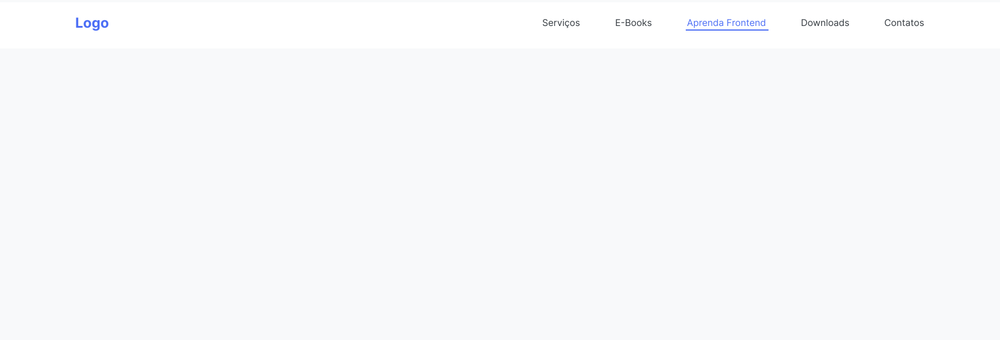

# Flexbox Step by Step

## Objective

Example of how it should look:

### Tasks

- [x] Center the container.
- [x] Apply the display as flex.
- [x] Align everything to the center of the column.
- [x] Create a wrap of items with `flex-wrap` (if the device shrinks the screen, the items must automatically be one below the other).
- [x] Leave it occupying 100% width.
- [x] Remove the default styles from list links.
- [x] Set color `#343A40` on link elements.
- [x] Change color oh h1 'Logo' element to `#4C6EF5`.
- [x] For this h1, set a `font-size` of 24 pixels.
- [x] Add hover effect to links, changing the color to `#4C6EF5`.
- [x] Font-Family used: 'Inter Sans Serif'.