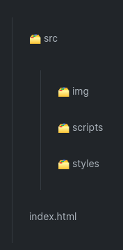

# S1 Structuring the front

In this activity we will organize the structure of a project following a pattern that we will use in the next classes. 
Remembering that there are other structures that are also used in the market.

## Atmosphere

We have a page developed for a stationery store, where all the logic and structure is in single files at the root of the project. 
However, in many moments when we need to maintain or implement something new, we can end up getting lost in many lines of code.


To have more agility when providing maintenance and better code readability, we need to maintain a well-organized structure.

## Preparing the structure

We started our development with the following content in our inde.html

```html
<head>

<link rel="stylesheet" href="./style.css">

<title>Stationery</title>

</head>

<body>

<header>

<!-- HEADER -->

</header>

<main>

<!-- MAIN CONTENT -->

</main>

<footer>

<!-- FOOTER -->

</footer>

<script src="./script.js"></script>

</body>
```

To start, let's create the following structure: a src folder that will contain all files and other folders. Inside src we will create the img, scripts and styles folders.

In the img folder we will place all the images from our project (in this example we are using just one image, but feel free to add other images to your activity).

In the scripts folder we will create our .js files as needed. In the styles folder we will create our .css files as needed.

We will have the following result:



## Organizing

In the body it is possible to notice that there are three base tags for our rendering via DOM.

Therefore, create four .js files and four .css files, three referring to the styling of the project's main tags, three referring to the code responsible for rendering each tag through the DOM, a globalStyles file to store the page's global stylings and a data file .js to store data related to products.


Make the following distribution: Inside the data.js file place the constant data. (Here you will need to change the property of the objects with the correct path of the images).

Inside the header.js file place the headerRender function and the execution of the function.

In the footer.js file, place the footerRender function and the execution of the function.

Now in the main.js file place the mainRender function and the execution of the function. This function works in conjunction with creating cards, so place the createCard function between the creation and the call of the mainRender function. (In the future you will learn to work with functions imported from other files, but at the moment it can be kept in the same file).

After separating each function into their respective files, it is necessary to add the path to them in index.html following the data loading order.

```html
<body>

<header>

<!-- HEADER -->

</header>

<main>

<!-- MAIN CONTENT -->

</main>

<footer>

<!-- FOOTER -->

</footer>

<script src="./src/scripts/data.js"></script>

<script src="./src/scripts/header.js"></script>

<script src="./src/scripts/main.js"></script>

<script src="./src/scripts/footer.js"></script>

</body>
```

