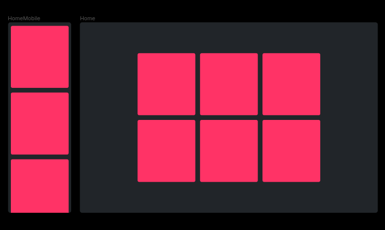

# Mobile First

## Notes

- Prioritize the most important content: Start with the most important content and add elements as you expand the layout to larger screen sizes.

- Use flexible units of measurement: Use flexible units of measurement, such as percentages, em or rem, rather than fixed pixels, to ensure that elements fit the device screen size.

- Use media queries to set breakpoints: Use media queries to set breakpoints and define different styles for each screen size.

- Simplify the layout: Limit the number of page elements and prioritize the most important content to ensure the site is easy to use on smaller screens.

- Testing on multiple devices: Make sure to test the website on multiple devices to ensure it is optimized for each screen size.

- 1. Set the Base Style for Mobile Devices
- 2. Set Your Breakpoints
- 3. Test your Media Queries
 