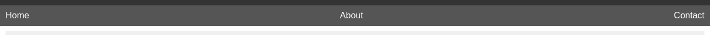

# S1 Display Flex

In today's class, we will learn about how to use Flex display in HTML and CSS projects. 
Display Flex is one of the most useful and powerful properties of CSS, as it allows you to create responsive layouts in a simpler and more efficient way. 
At the end of this class, you will be able to:
- Understand how the Flex display works
- Use Flex properties to create responsive layouts
- Apply Flex display to your own projects

## Part 1: Creating a simple layout

In this first part, we will create a simple layout using the Flex display. 
Let's start by creating the HTML file with the basic structure:
```html
<!DOCTYPE html>
<html>
   <head>
     <title>Examples of Flex display usage</title>
     <link rel="stylesheet" href="style.css">
   </head>
   <body>
     <header>
       <h1>My website</h1>
     </header>
     <nav>
       <ul>
         <li><a href="#">Home</a></li>
         <li><a href="#">About</a></li>
         <li><a href="#">Contact</a></li>
       </ul>
     </nav>
     <main>
       <section>
         <h2>Welcome to my website</h2>
         <p>This is an example website created to demonstrate how to use Flex display in HTML and CSS projects.</p>
       </section>
     </main>
     <footer>
       <p>Copyright © 2023 My Site</p>
     </footer>
   </body>
</html>
```


Now, let's add some basic styles to our CSS file:

```css
body {
  margin: 0;
  padding: 0;
  font-family: sans-serif;
}

header {
  background-color: #333;
  color: #fff;
  padding: 10px;
}

nav {
  background-color: #555;
  color: #fff;
  padding: 10px;
}

nav ul {
  list-style: none;
  margin: 0;
  padding: 0;
}

nav li {
  margin-right: 10px;
}

nav li:last-child {
  margin-right: 0;
}

nav a {
  color: #fff;
  text-decoration: none;
}

main {
  padding: 10px;
}

section {
  background-color: #f0f0f0;
  padding: 10px;
}

footer {
  background-color: #333;
  color: #fff;
  padding: 10px;
  text-align: center;
}
```

With these styles, we already have a basic structure for our project, with a header, a navigation bar, main content and a footer.


## Part 2: Applying Flex display

To apply display Flex to our project, we will add the display: flex property to some elements. Let's start with the navigation bar. 
We want the navigation bar items to be displayed on a single line, with some space between them. 
To do this, let's add the display: flex property to the unordered list ul of the navigation bar:

```css
nav ul {
  list-style: none;
  margin: 0;
  padding: 0;
  display: flex;
}
```


Now the navigation bar items will be displayed on a single line. 
However, we still need to add some space between them. 
To do this, let's add the justify-content: space-between property to the ul list:

```css
nav ul {
  list-style: none;
  margin: 0;
  padding: 0;
  display: flex;
  justify-content: space-between;
}
```



Now, navigation bar items will be displayed on a single line, with space between them. 
The next step is to add the Flex display to the main content, so we can display the elements in a flexible grid. 
Let's add the display: flex property to the main section:

```css
main {
  padding: 10px;
  display: flex;
}
```

Now the main content elements will be displayed in a flexible grid. 
We can control the size and position of these elements using Flex properties. 
For example, let's add the flex: 1 property to the section element, so that it occupies all the available space in the grid:

```css
section {
  background-color: #f0f0f0;
  padding: 10px;
  flex: 1;
}
```

We can also add the flex-direction property to control the direction of elements in the flex grid. 
By default, the direction is row, which means that elements are displayed in a single line. 
But we can change the direction to column, which means the elements will be displayed in a single column. 
Let's add the flex-direction: column property in the main section:

```css
main {
  padding: 10px;
  display: flex;
  flex-direction: column;
}
```

Now the main content elements will be displayed in a single column. 
Finally, we can add the align-items property to control the alignment of elements in the flexible grid. 
Let's add the align-items: center property to the main section, so the elements are vertically centered:

```css
main {
  padding: 10px;
  display: flex;
  flex-direction: column;
  align-items: center;
}
```

Now the main content elements will be vertically centered on the page.

## Exercise

To practice what we learned in this class, let's do a little exercise. 
Add the display: flex property to the footer element, and display the elements on a single line, with space between them. 
Then, add the flex: 1 property to the p element inside the footer, so that it occupies all the available space on the line. 
Finally, add the justify-content: flex-end property to the footer, so that the text of the p element is aligned to the right of the line. 
If you want, you can also add other Flex properties to further explore the possibilities.

```html
<footer>
   <p>Example of exercise</p>
   <a href="#">Link 1</a>
   <a href="#">Link 2</a>
   <a href="#">Link 3</a>
</footer>
```

```css
footer {
  display: flex;
  justify-content: flex-end;
  background-color: #333;
  color: #fff;
  height: 50px;
  width: 100%;
  position: fixed;
  bottom: 0;
  left: 0;
}

p {
  flex: 1;
}

a {
  color: #fff;
  text-decoration: none;
  margin-right: 10px;
}
```
In this code, we added some properties to the body's global style, such as margin and padding, to remove the browser's default margin and padding. 
Next, we add some properties to the footer style, such as height, width and fixed position, so that it occupies the entire width and is stuck at the page footer. 
Additionally, we added a dark background and white color to the text of the links, so that they are more visible.

With these changes, the exercise will be fixed to the page footer and the elements will be displayed on a single line, with the text aligned to the right of the page.


