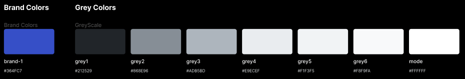
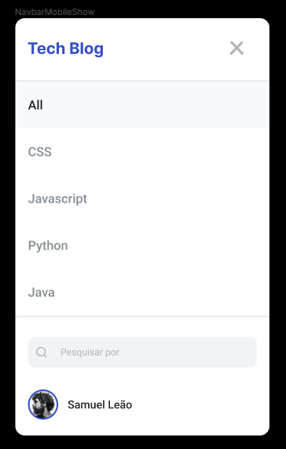
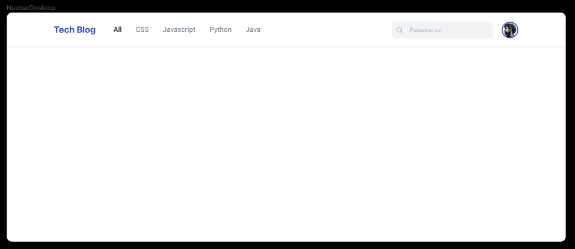

# S2 Advanced Responsive Menu

In this activity you must use the concepts learned in the responsiveness theme classes, thus providing a responsive component, which in the context we are going to apply, will be an options menu, a visual component very present in web applications.








In addition to the visual layer, develop a functionality that, on mobile, expands and hides the screen menu for the user, based on the click action.


Try using transition to make the menu bounce!

```css
.nav {
  transition: cubic-bezier(0.64, 0.02, 0.41, 1.25) .8s;
}
```

TODO:

estilizar o hamburguer menu e deixar ele pronto

fazer a logica de abrir e fechar

aplicar as animações

terminar de estilizar

deixar escalavel

